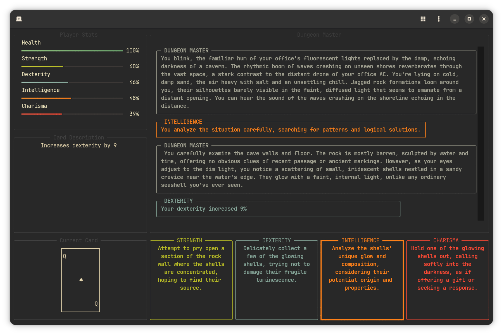
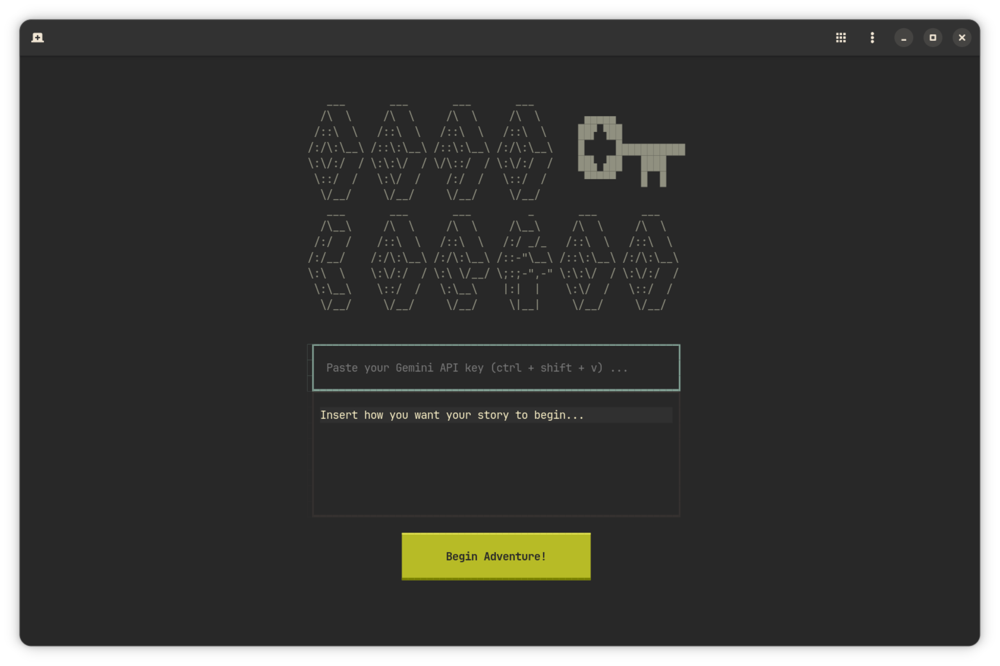
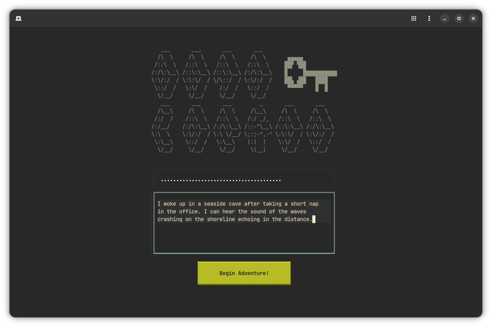

# Deadlocked

DEADLOCKED is an AI-powered, text-based adventure game inspired by Dungeons & Dragons. You are guided by a soulless Dungeon Master through a unique, dynamically generated story that begins with a prompt of your choice. Navigate the narrative by choosing from four core attributes: Strength, Dexterity, Intelligence, and Charisma. Your choices, combined with a card-drawing mechanic that modifies the outcome of your actions, will shape your journey and alter your character's stats. Manage your Health and attributes carefully. If your Health falls to zero, your adventure ends. The entire experience is played through a stylish, keyboard-driven terminal interface.



## Installation

### Prerequisites

- Python 3.8 or higher
- Gemini API key from Google AI Studio

### Quick Setup

1. Install dependencies:

``` bash
pip install -r requirements.txt
```


2. Start the TUI:

``` bash
python main.py
``` 

## Launch your adventure

1. Enter the dungeon key when prompted (Gemini API key)
2. Describe how you want your story to begin
3. Press "Begin Adventure!" and let the chaos unfold



